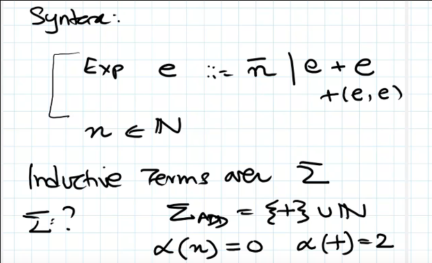
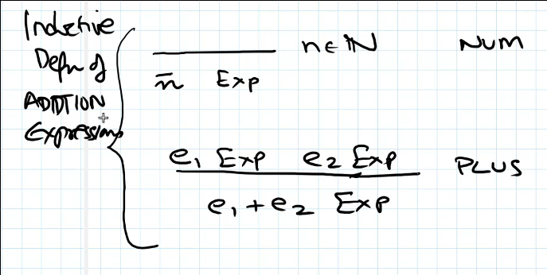
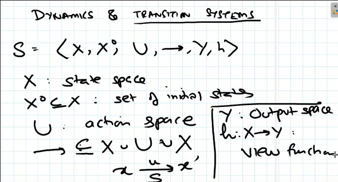
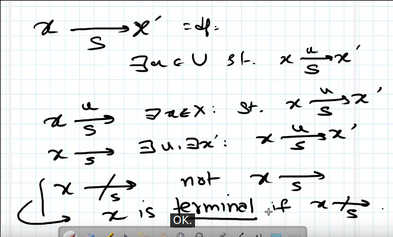
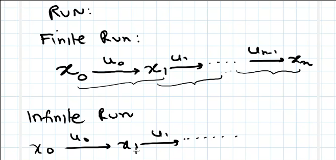
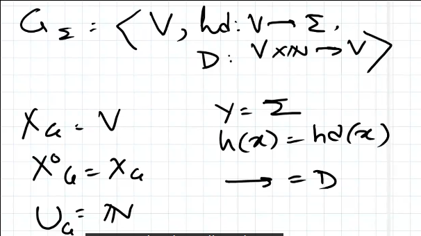
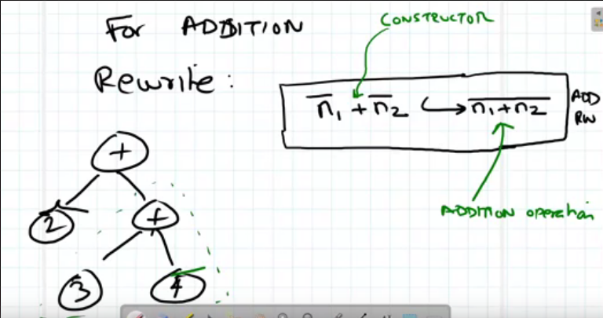

- Till now, we studied syntax
- Now, semantics or dynamics/evaluations of expressions
- Again, defining syntax formally in terms of trees

Overview of what we will cover:

- Addition language
- Syntax and interactive semantics

Syntax:

- Consider the syntax for the addition language 
  
   
- Hereon, "term" = inductive term unless otherwise specified
- How to evaluate: say `2() + (3() + 4()) → 2() + 7() → 9()`
- Defining a transition system: 
  
  
- Defining something? TODO 
  
  
  
  Along those lines, *what is a Run* 
  
  
- Term graph as a system 
  
   
  
  Useful for lots of things, including data structures, can look at *what* as  
  transitions and navigate around.
- TODO Subterms, replacements
- Addition and rewrite rules 
  
  
- TODO this well. Addition as a system
