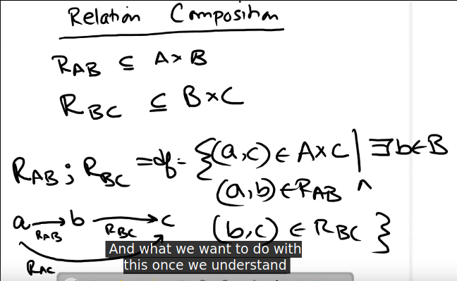
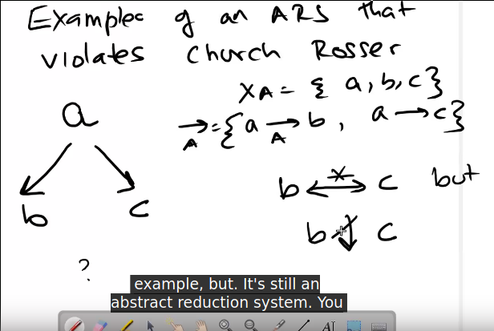

- Abstract Reduction Systems
- Basically a set and a relation
- Relation composition 
  
  
- Derived Abstract Reduction systems
- Essential idea is the simplification of programs like in high school algebra.
- Normal form: not reducible
- `y` is normal form of `x` if `x → .. → y`
- `y` is simplified of `x` if `x → .. → y`
- `y` is direct successor of `x` if `x → y`
- `y` is successor of `x` if `x → .. → y`
- `x` and `y` are *joinable* if `x → .. → z` and `y → .. → z`
- Properties of abstraction systems:
    - *Church Rosser*: ∀ a, b, if a <-> b, a and b joinable 
      
      Example of not: 
    - If system has *Church rosser* property, then LHS <-> RHS is possible.
      Simplification possible
