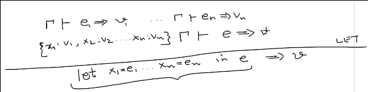

-  
  
  Over here, think of the expression `e` with `n+1` parts. `e₁ ... ` are the 
  "let" expression expressions. Given the bigger environment $\Gamma$, each of 
  `e₁ ...` evaluates to `v₁ ...`, and then we compose each of those on top of 
  the $\Gamma$ to get the fresh environment.$
