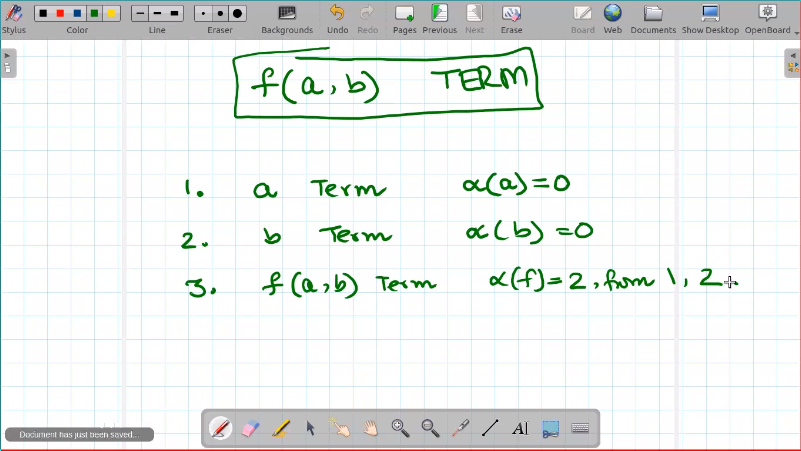
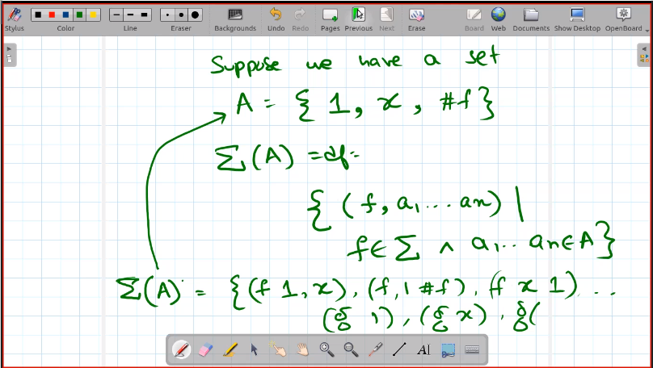

**Agenda**: Syntax (Co-inductive Terms)

- Last time, we had **terms**, defined in terms of induction and expression:
    - Defining a base case for an expression
    - Inductively, defining the set of all expressions
    - This was done for an *operation*
    - Example from last class 
    ```
    |--------------------|           |
    | if n ∈  N          | num rule  |
    | ⇒ n AST            |           |  Defines all
    |         OR         |            > expressions
    | if e1 AST & e2 AST | plus rule |  in addition
    | ⇒ + e1 e2 AST      |           |
    |--------------------|           |
    ```
- This time, we will focus on *Structural Induction*: on trees, instead of n 

# Generalising induction

- We want to define *terms* inductively. **Inductive terms**
- We assume an alphabet ∑ of constructor symbols
    - What are *constructor symbols*? Kind of like functions that operate on
      some terms (arity, as we shall find out) and return terms as results. 
      Think of the '+' operator.
    - `Eg: ∑ = {f, g, a, b}`
- We define an "arity" function that operates on α:∑ → N (Natural numbers)
    - Arity defines how many parameters the operator can take.
    - `Eg: α(f) = 2, α(g) = 1, α(a) = α(b) = 0`
- So, terms can be built like: 
  ```
  f(a(), b()) \_ inductively building terms
  f(g(a), b)  /
  ```
- So, to *define* **inductive terms**: Given a *constructor symbol f* with 
  *arity α(f) = n* and *n terms*, f(the n terms) = a new term
  ```
  t₁ ... n terms  and α(f) = n     \
  ----------------------------      > constructor rule
  ⇒ f(t₁ ... n terms) is a term    /
  ```
- Can be used to make judgements on terms (slide below)
  
  
- **wordy definition of this**:
    - if t₁ ... n are Terms
    - and f ∈ ∑ s.t. α(f) = n
    - then f(t₁...n) is a term
- *The set of all Inductive terms over ∑ ⇒ T_ind(∑) is the smallest set
  satisfying the above properties*:
  
  ```
  So Tᵢₙ∑ would have: 
    a, b, f a b, g a, g b, f g a b, f a g b, 
    g f a b, f g f a b a, etc
  ```
- **Why bother with a boring induction based proof?** We will move on to
  eventually define evaluation itself as an induction system, not just terms.


  
- What is a set $X = \sigma(X)$. We need the least solution, as there
are many. 

$T_{ind}$ is the least solution.

Saying that this is the least solution and giving the definition of it
is identical.
- Is it possible to have 'infinite' terms? 

```
We have                  Can we have
          +                          g
         / \                        / 
        a   b                      g'    or  g<-\
                                  /          |__| 
                                 g''
        
```
- Any proof is a finite structure
- The set itself is infinite
- But every element in the set if finitely constructed
- $T_{ind} = \sigma(T_{ind}) \subset T_{ind}$
