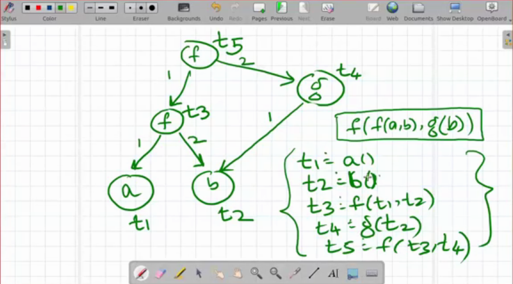

# In class

- We know the **Well-foundedness Property of Inductive Terms**: There is no
  inductive term `T` s.t. `T` is a proper subterm of itself:
    - So we can't have terms like `T = g(T)`
    - But we might a term like that for *streams* 
      
      ```
         g←┐    Circular terms
         └─┘
      ```
    - The following is seemingly an aside. Skip if you need to.
        - Consider the following definition
          
          ```
          TREE             DAG
            f               f
          ₁/ \₂            ( )
          a   a             a
          -----           -----
          f a a           f a a
          ```
          In the DAG, the 'a' is shared. It is like 
          ```scheme
          (define (a) (list 'a))
          (define (f t1 t2) (list 'f t1 t2))
          (let ([t (a)])
            (f t t))
          ```
          But in the tree form, it is more
          ```scheme
          (let ([t1 (a)]  
                [t2 (a)])
            (f t1 t2))
          ;; note that t1 and t2 are different
          > (eq? (a) (a))
          #f
          > (equal? (a) (a))
          #t
          ```
# Term Graphs

And defining them in terms of equations

- **Term Graphs**: A term graph over a signature Σ is a structure <V, h, →>
  where 
  1. **V** is a set of vertices
  2. **h**: V → Σ (head)
  3. **→** ⊆  V x N₁ x V  (v,i,v' written as v-i->v')
  4. if h(v) ∈  Σ⁽ⁿ⁾, then v has exactly n out-edges. For each i: 1≤i≤n, there
     is exactly⁾, then v has exactly 1 out-edge labelled i.
- Defining some *notation*:
    - if h(v) = f and
    - f ∈  Σ⁽ⁿ⁾ and
    - v -i-> v_i for 1≤i≤n
    - Then, we write this as 
      
      v ≅ f(v₁ ... v_n) *(≅ is actually '=' with a dot on top)*
- Consider examples:
  
  ```
        (f)t₁     v = {t₁ t₂ t₃} │ t₂ ≅ a()
       ₁/ \₂      h = { t₁ → f   │ t₃ ≅ b()
    t₂(a) (b)t₃         t₂ → a   │ t₁ ≅ f(t₂ t₃)
    G=<v,h,→>           t₃ → b } │ ─────────────
                                 │ this is a term
                                 │ graph written down
                                 │ as a set of equations
    
  f has arity 2, so it needs 2 out-edges
  
  We can also have
      (g)←┐
      └───┘
  ```
  
  For another example, we can see:
  
  

# Path/Position

- From the term graph above, we can write something like 
  t₅ ─²→ t₄ ─¹→ t₂
- A simpler way to do that is 
  t₅ ─²¹→ t₂
- This ²¹ is called the **path/position**
- The path `21` takes t₅ to t₂
- **REF rule**:
  
  `v ─[]-> v`
  
  **TRANS rule**:
  
  `v' ─[p]→ v''` and `v ─[i]→ v'`, then
  
  `v ─[i.p]→ v''`
- Now, also: 
  
  if `v ─[p]→ r` and `v ─[p]→ s`, then `r == s`
- TODO after this
- Position space
- paths == position
- pos(t1): all paths to all accessible vs.
- Term can be reconstructed from pos v and → ∑
- Position space: set of positions p, prefix closed: for all terms of the set, 
  each prefix is also a term in the set. *Motivation*: Eliminating v 
  
  Basically defines term v, without the v. 1 Position space defines a term 
  graph's subtree.
- Behaviour: mapping from terms to ∑, but upwards complete. Interaction.
- term over Σ is a behavious over Σ


# Behaviour
