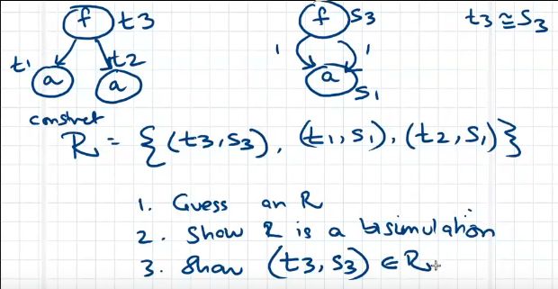

Revision

- Inductive term cannot be a subterm of itself, but a coinductive term can be.

Bisimulation

- A quick flashback to term graphs and behaviours 
  
  $$\sigma$$
  
  
- A motivation for bisimulation: all the terms are intuitively the same 
  
  
- **Bisimilarity** establishes equivalence of behavious by examining the
  structure of the term graph containing two vertices:
    - Equivalence of objects is modulo observation
    - In case of terms, observations are constructor symbols and we are allowed
      to look at the head of the term in order to identify the constructor
    - Equal terms should have equal heads + equality for corresponding pair of
      subterms --> *Inference rule down*, and *rule up*
    - Issues with circular reasoning, however
    - **Intuitive idea behind bisimulation**: just say that the 2 things are
      equal, and challenge anyone to show a mistake.
    - Unlike induction, here you construct an argument and then ask people to
      pick holes in it. Proof by construction, where it is entirely internally
      consistent.
- So, for bisimilarity `R`:
    - `hd(v) == hd(v')`
    - for each `i`, $$1 \leq i \leq \alpha (hd(v))$$, for all `i`: 
      $subterm_i(v), subterm_i(v') \in  R$
- Non-example 
  
  
- Setup for a bisimilarity proof 
  
   
  
  Demonstration of showing/proof:
  
  
- Setup for a bisimulation break 
  
  
  
  Proof:  

Replacement for inductive terms

- Replace subterm `t'` at position `p`, with say `S`

Replacement for coinductive terms

