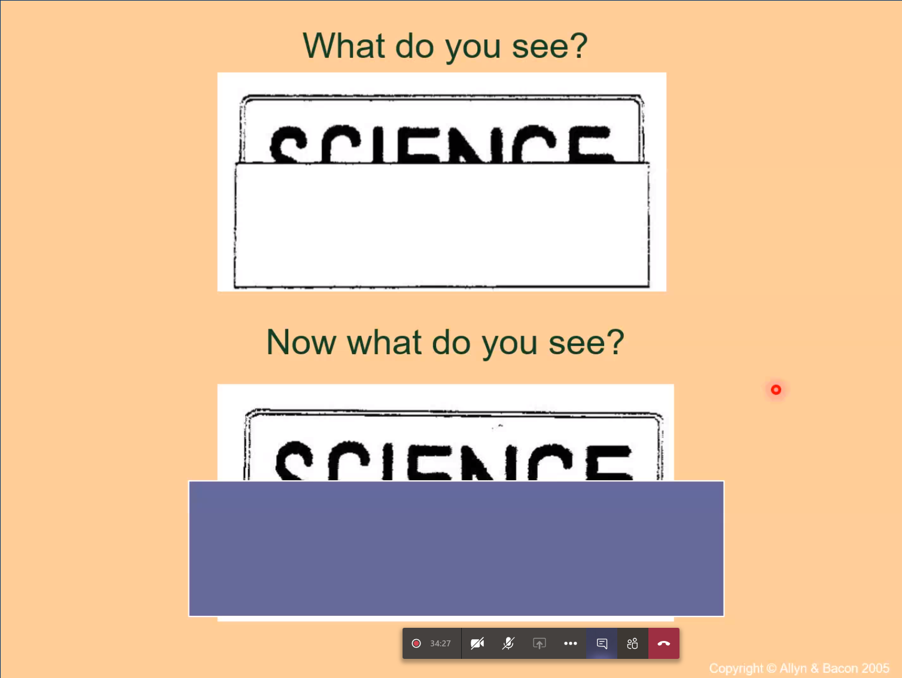
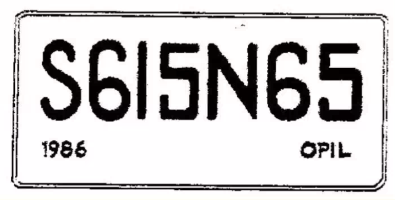

# Perception

Bottom-up processing

: Looking at information and perceiving based on that

Top-down processing

: Expecting a perception and making one to fit.

Example given:

This is top down. Knowing english, we try to make sense of this, and the image
makes us initially think it says "science": it is out top-down knowledge that
makes us think this.

This is the actual image:

# The computer model of the mind

- People have said that the mind is like a computer.
- Dominant view: the mind is organised such that information is processed
  accordingly. 
  
## What is the computer model?

- Mind is info-processing system
    - Computers are: programs operating on symbols
    - ???? internet went.

- Mental representations
    - These are the symbols that encode information.
    - So, thinking about a concept `P` activates the mental representation of
      the concept `P`

- Mind information processing:
    - Perception: Acquiting real time information
    - Language Use: ??? 
    - Reasoning: ???
    - Action: ???

### Marr's 3 levels of analysis

To understand a phenomenon, understand it at:

- Computation/problem level
- Algorithmic level
- Implementation level

These are all supposed to be independent of each other, and also we don't need
to worry about how the implementation will be done? or something.

Later it was felt that these are not as independent as Marr thought, but they
are interacting.

In this view: How to think about cognitive science :

|           | Language | Vision | Reasoning | Other areas |
|-----------|----------|--------|-----------|-------------|
| Task      |          |        |           |             |
| Algorithm |          |        |           |             |
| Hardware  |          |        |           |             |

# Summary

> Question: Is computation necessary, or sufficient, to explain all the mental
phenomenon? What about consciousness?

It's a sufficient way to explain phenomenon without giving an explanation for
consciousness or something of that sort.

## Assignment:

Add a few more names and give justification for why they should be added.
