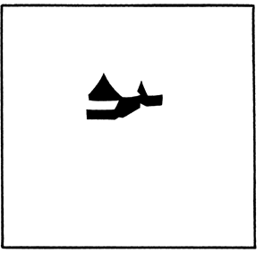

1. **When asked to name the object seen in the image (below), the answers range 
   from bird, boat, just irregular shapes, to hanuman. But if someone sees 
   'snow-covered farm buildings', then it is perception. Now understand a) what
   can be the possible explanation for someone to 'see' snow-covered farm 
   building? and b) given most Indians have not seen such a scene how will they
   form it given the clue?**
   
   
   
   When trying to perceive an object, there are two general approaches: a
   top-down approach and a bottom-up approach. Each is triggered differently
   based on experience [@blakemore_development_1970] - if the object we see
   matches our visual experience, then we identify it as such without trying
   to identify individual components - think of how we see a car rather than a
   door, a hood, etc. If it does not, we try to identify the object by
   identifying individual components and trying to make sense of it together,
   or Recognition by Components (RBC), introduced by 
   @biederman_recognition-by-components_1987 .
   
   Especially with limited silhouetted images like this one, identification is
   commonly
   done by applying heuristics. Gestalt principles (introduced by Max Wertheimer
   [@king_max_2005], and claimed by @todorovic_gestalt_2008 as still
   applicable to modern perception theory) are fundamental in defining here
   how we perceive objects top-down.
   
   So in this instance, the experience of having seen snow-covered buildings,
   especially those with slanting roofs, is the experience necessary to perceive
   the image as 'snow-covered buildings', let alone farm buildings. The
   environment one grows up in shapes the patterns their brains focus on
   recognising (Experience-dependent plasticity, described by
   @blakemore_development_1970). The ideal environment to grow up in to identify
   the image right away would be a snow-heavy area with frequent near-whiteouts
   and slanting roofs.
   
   Given that most Indians will not have seen such a scene - with different
   experiences on building styles and climate, they do not instantly fit the 
   model of a snow-covered farmhouse to the stimuli. Rather, they try to process
   it bottom-up, identifying components and building a reasonable approximation,
   aka RBC [@biederman_recognition-by-components_1987]. Interestingly, they will
   also tend to ignore the whitespace altogether, not bothering to see how it
   might fit together to form an image.
   
   I attempted to observe this phenomenon concretely, and asked seven Indians
   what they saw in the image. One of them has been living in Boston for three
   years, and recognised the image as a house with snow instantly, demonstrating
   the impact of experience on perception. With the other six, none of them got
   it in the first try. The following features were noticed:
   
   - None of them initially considered the whitespace to be a key feature of the
     image
   - 
     
     A lot of the initial answers were dragon/flying dinosaur/bird. People
     seemed to identify by components - first, the larger triangle as misshapen 
     wings and going with the
     closest flying animal in their imagination. It has been suggested that the
     dinosaur trend was due to Google Chrome's offline dinosaur game, which also
     builds a dinosaur from blocky grey splotches. 
     
   - All of the guesses could be attributed to bottom-up processing. When
     someone guessed "two mountains and a valley", they identified the two
     triangles as mountains and the middle strip as a river. When someone
     identified a "mountain, a sailboat, and a jetty", they took the large and
     small triangles as the mountain and sailboat respectively, and the jetty
     was made by identifying negative space - the only such instance.
   - All participants were given hints about trying to guess with respect to it
     being:
     
     1. Something not seen often in India
     2. If seen in India, in the north - the Himalayas
     3. It has something to do with the climate
     4. It's a house
     
     Most people guessed by Step 3. One person guessed at Step 1, and two people
     took till Step 4 of whom one did not see it even after.
   - Some other first guesses were:
       1. Broken sphinx
       2. Anime Hair
       3. 2004 graphics superman
       4. Robot Dog

2. **“Mirror Neuron Theory is a myth.” Explain the mirror neuron theory based on 
   Giacomo Rizzolatti’s work. What are the criticisms against it and what is 
   your opinion on this debate?**
   
   Broadly, the mirror neuron theory posits that "motor representation is at the
   basis of the understanding of motor events" [@rizzolatti_premotor_1996],
   which is to say that the same neurons in the system react not only to doing
   an action, but also observing someone else do it. Literature refers to it as
   "action-based processing". For instance, [@alluri_connectivity_2017] 
   have shown evidence for such with how processing differs when musicians and
   non-musicians listen to music, where "musicians automatically engage neural 
   networks that are action-based while non-musicians employ those that 
   are perception-based to process an incoming auditory stream."
   
   Rizzolatti's work noted that mirror neurons exist in the frontal F5 area of
   the brain of macaque monkeys, and these respond both when monkeys:
   
   1. *Make* active movements
   2. *Observe* someone else making the same meaningful movements
   
   This was clear demonstration of the existence of mirror neurons in a species.
   They also suggested that given existing data and the information just given,
   it might be the case that the observation that motor actions activate the
   posterior part of the inferior frontal gyrus may imply the existence of
   mirror neurons in humans too, possible affecting verbal development - as
   there was a homology of the frontal F5 area in the monkeys with Broca's area
   in humans.
   
   The theory is not without its critiques. First is the fact that it is not
   possible to study individual neurons in the human brain, so most evidence for
   their existence is indirect.
   
   Secondly, @pascolo_mirror-neuron_2009 claim that it is not clear whether 
   mirror neurons really form a distinct class of cells, and are not just an 
   occasional phenomenon that are seen in cells that have other dedicated 
   functions. 
   
   @hickok_eight_2009 argued that "The early hypothesis that these cells 
   underlie action understanding is likewise an interesting and prima 
   facie reasonable idea. However, despite its widespread acceptance, the 
   proposal has never been adequately tested in monkeys, and in humans 
   there is strong empirical evidence, in the form of physiological and 
   neuropsychological (double-) dissociations, against the claim". The lack of
   direct evidence, therefore, is the primary roadblock to acceptance of the
   mirror neuron theory.

   Evidence, although indirect, suggests that there exist mirror neurons in the
   human brain. The existence of action-based processing is undeniable - it has
   been demonstrated with music [@alluri_connectivity_2017], treatment of
   aphasia [@chen_aphasia_nodate], have been hypothesized to help with speech
   processing and language acquisition [@hickok_role_2010; @behme_role_2014] .

# References
